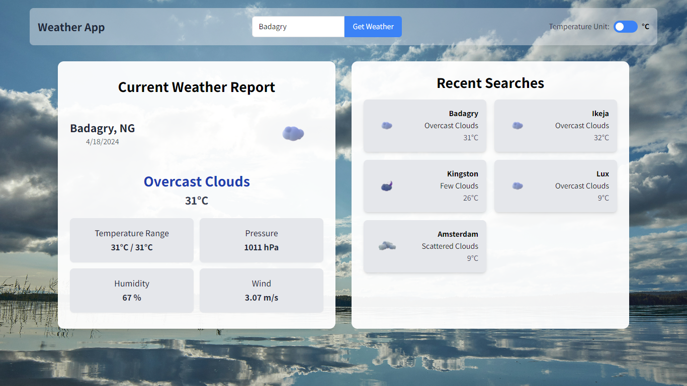

# Weather App

The Weather App is a simple web application that allows users to check the current weather and help them keep tabs on their recent search history.



## Table of Contents

- [Weather App](#weather-app)
  - [Table of Contents](#table-of-contents)
  - [Technology Used](#technology-used)
    - [React](#react)
    - [TypeScript](#typescript)
    - [Next.Js](#nextjs)
    - [Tailwind CSS](#tailwind-css)
    - [OpenWeatherMap API](#openweathermap-api)
  - [Installation](#installation)
  - [Usage](#usage)
  - [Demo](#demo)
  - [Features](#features)
  - [Future Improvements](#future-improvements)
  - [Contributing](#contributing)
  - [License](#license)

## Technology Used

### React

React is a popular JavaScript library for building user interfaces. It allows you to create reusable components, manage state, and efficiently update the UI. React’s virtual DOM ensures optimal performance by minimizing unnecessary re-renders.

### TypeScript

TypeScript is a statically typed superset of JavaScript. By adding type annotations, you can catch errors early, improve code quality, and enhance developer productivity. TypeScript integrates seamlessly with React and Next.js, making it a great choice for building robust applications.

### Next.Js

Next.Js is a powerful React framework that simplifies server-side rendering (SSR) and static site generation (SSG). It provides features like automatic code splitting, routing, and API routes out of the box. Next.Js enhances SEO, improves performance, and streamlines development.

### Tailwind CSS

Tailwind CSS is a utility-first CSS framework. It allows you to create responsive designs by composing utility classes directly in your HTML. With Tailwind, you can rapidly style your components without writing custom CSS. Its flexibility and consistency make it a favorite among developers.

### OpenWeatherMap API

The OpenWeatherMap API provides real-time weather data for cities worldwide. By integrating this API into your app, you can fetch information such as current weather conditions, forecasts, and historical data. Make sure to handle API requests securely and efficiently.

## Installation

1. Clone the repository

   ```bash
      git clone https://github.com/Boluwatife-AJB/weather-app.git
   ```

2. Navigate to the project directory:

   ```bash
      cd weather-app
   ```

3. Install the dependencies

   ```bash
      npm install
   ```

4. Create a local environment file (.env.local) and add your [OpenWeatherApp](https://openweathermap.org/) API key:

   ```bash
      NEXT_PUBLIC_WEATHER_API_KEY=your_api_key_here
   ```

5. Start the development server:

   ```bash
      npm run dev
   ```

6. Open your browser and visit <http://localhost:3000> to view the app. However if you have a local server running on <http://localhost:300> try running it on <http://localhost:3001>

## Usage

1. Enter the name of a city in the input field and click "Get Weather" to fetch weather data.
2. Toggle between Celsius and Fahrenheit units using the temperature toggle button.
3. View the current weather and forecast for the selected city.
4. Recent searches are displayed on the right side for quick access.

## Demo

You can preview the live project [here](https://weather-app-theta-nine-60.vercel.app/)

## Features

- **Current Weather**: View the current weather conditions, including temperature, description, pressure, humidity, and wind speed.
- **Temperature Toggle**: Toggle between Celsius and Fahrenheit units to view temperature in preferred units.
- **Recent Searches**: Keep track of recent city searches and easily revisit them.

## Future Improvements

- **UI/UX Enhancements**: Implement a more visually appealing design with better user experience.
- **Optimization**: Optimize the application for performance by reducing load times and optimizing code.
- **Localization**: Add support for multiple languages to make the application accessible to users from different regions.
- **Geolocation**: Implement geolocation functionality to automatically detect and display weather information based on the user's location.
- **Persistent Storage**: Store recent city searches in local storage or a database to maintain user preferences across sessions.
- **Accessibility**: Ensure the application meets accessibility standards to accommodate users with disabilities.
- **Documentation**: Improve documentation to make it easier for developers to understand and contribute to the project.

## Contributing

Contributions to the Weather App are always welcome! If you'd like to contribute, please follow these steps:

1. Fork the repository.
2. Create a new branch (git checkout -b feature/new-feature).
3. Make your changes and commit them (git commit -am 'Add new feature').
4. Push to the branch (git push origin feature/new-feature).
5. Create a new pull request.

Thank you for helping to improve the Weather App!

## License

This project is licensed under the [MIT License](LICENSE).
